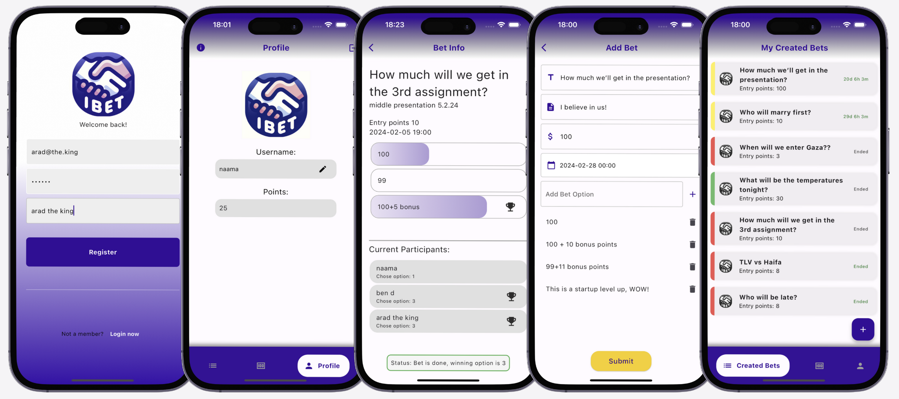

# ibet: Fun & Friendly Way to Bet with Friends!

## Screenshots



## System Architecture and Diagrams

Below you'll find links to documents and diagrams that outline the system architecture, design considerations, and various components of the "ibet" app. These resources are essential for understanding the application's functionality and structure.

#### Documentation
- **Presentation:** [View Document](ibet-presentation-deck.pdf)
- **Initiation Document:** [View Document](docs/initiationDocument.pdf)
- **Requirements Document:** [View Document](docs/Document_ofRequirements.pdf)

#### UML and Process Flow Diagrams

Explore the structure and flow of the application with our comprehensive UML and process diagrams.

- **Use Case Diagram:** [View Diagram](docs/UseCaes.png)
- **Class Diagram:** [View Diagram](docs/ClassDiagram.png)
- **Object Diagram:** [View Diagram](docs/ObjectDiagram.png)
- **Activity Diagram:** [View Diagram](docs/Activity.png)
- **Sequence Diagrams:** [First Diagram](docs/Sequence1.png) | [Second Diagram](docs/Sequence2.png)
- **State Machine Diagram:** [View Diagram](docs/StateMachine.png)

#### Data Modeling

Gain insights into the data structure and relationships within the system.

- **ERD Diagram:** [View Diagram](docs/ERD.png)

## Features

- Create bets with friends
- Invite friends to join using the app
- Use app points for betting
- No ads
- No money included
- Fun!!!

and much more...
Check it yourself :)

## Building from Source

1. If you don't have Flutter SDK installed, please visit official [Flutter](https://flutter.dev/) site.
2. Fetch latest source code from master branch.

```
git clone https://github.com/aradbm/ibet.git
```

3. Run the app with Android Studio or VS Code. Or the command line:

```
flutter pub get
flutter run
```
