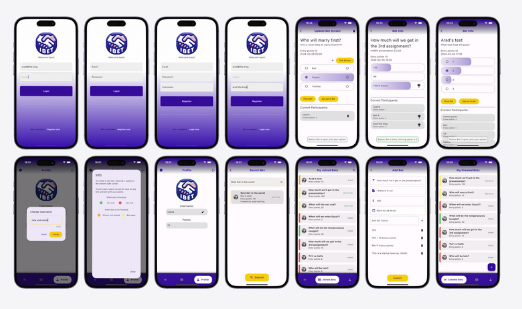

# ibet

An app for creating bets with friends!




# Diagrams & System architecture
link to initiation document :
[Link Text](docs/initiationDocument.pdf)

    link to document of requirements: 
[Link Text](docs/Document_ofRequirements.pdf)

Use Case diagram:
[Link Text](docs/UseCaes.png)  
Class diagram:
[Link Text](docs/ClassDiagram.png)  
Object diagram:
[Link Text](docs/ObjectDiagram.png)  
Activity diagram:
[Link Text](docs/Activity.png)  
Sequence diagram:
[Link Text](docs/Sequence1.png) , [Link Text](docs/Sequence2.png)  

StateMachine diagram:
[Link Text](docs/StateMachine.png) 

ERD diagram:
[Link Text](docs/ERD.png) 

## Features

- Create bets with friends
- Invite friends to join using the app
- Use app points for betting
- No ads
- No money included
- Fun!!!

and much more...
Check it yourself :)

## Building from Source

1. If you don't have Flutter SDK installed, please visit official [Flutter](https://flutter.dev/) site.
2. Fetch latest source code from master branch.

```
git clone https://github.com/aradbm/ibet.git
```

3. Run the app with Android Studio or VS Code. Or the command line:

```
flutter pub get
flutter run
```


