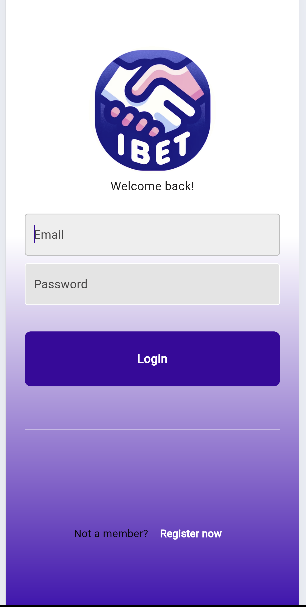
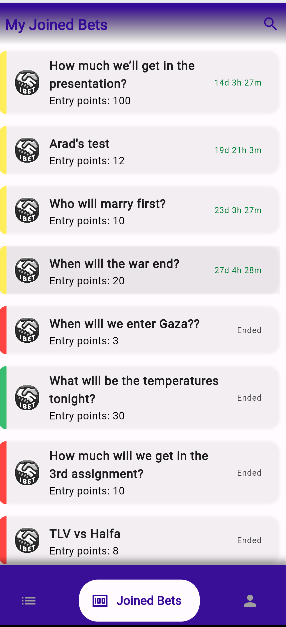
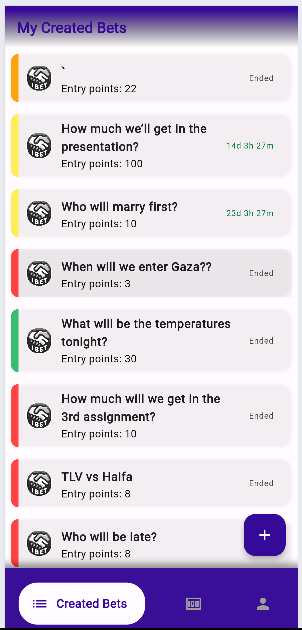
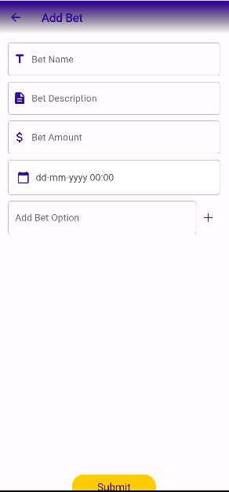
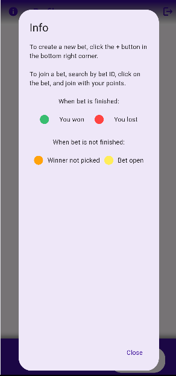

# ibet

An app for creating bets with friends!


Login page



myBets



SearchBet


myCreatedBets



AddBet



Profile


Info_Page



## Features

- Create bets with friends
- Invite friends to join using the app
- Use app points for betting
- No ads
- No money included
- Fun!!!

and much more...
Check it yourself :)

## Building from Source

1. If you don't have Flutter SDK installed, please visit official [Flutter](https://flutter.dev/) site.
2. Fetch latest source code from master branch.

```
git clone https://github.com/aradbm/ibet.git
```

3. Run the app with Android Studio or VS Code. Or the command line:

```
flutter pub get
flutter run
```
